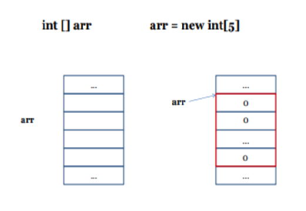
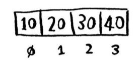
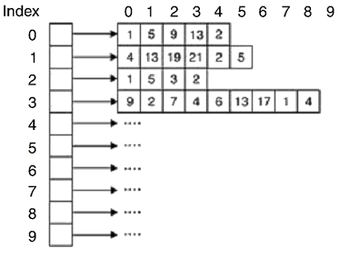

## №1 Типы данных, условные операторы, циклы.

----
* Для оптимальной работы приложения JVM делит память на область стека (stack) и область кучи (heap). Всякий раз, когда мы объявляем новые переменные, создаем объекты или вызываем новый метод, JVM выделяет память для этих операций в стеке или в куче.
>  Основные особенности стека:
> * Он заполняется и освобождается по мере вызова и завершения новых методов
> * Переменные в стеке существуют до тех пор, пока выполняется метод в котором они были созданы
> * Если память стека будет заполнена, Java бросит исключение *java.lang.StackOverFlowError*
> * Доступ к этой области памяти осуществляется быстрее, чем к куче

> Основные особенности кучи:
> * Когда эта область памяти полностью заполняется, Java бросает *java.lang.OutOfMemoryError*
> * Доступ к ней значительно медленнее, чем к стеку
> * Эта память, в отличие от стека, автоматически не освобождается. Для сбора неиспользуемых объектов используется сборщик мусора (О нем мы поговорим на следующих уроках)

* Примитивные типы данных хранят в себе **значение**. Так как они находятся в стеке доступ к ним осуществляется
  быстрее, чем к ссылочным типам.

### Диапазоны значений примитивов

| Тип     | Диапазон значений                         |Разрядность (в байтах) | 
|---------|-------------------------------------------|-----------------------|
| long    (целочисленный)|[ - 261; 261 - 1]    |      8                |  
| int     (целочисленный  |[ - 231; 231 - 1]    |      4                |  
| double  (вещественный)  |[ - 261; 261 - 1]    |      8                |
| float   (вещественный)   |[ - 231; 231 - 1]    |      4                |
| short   (целочисленный)|[ - 215; 215 - 1]    |      2                |
| byte    (целочисленный) |[ - 27; 27 - 1]      |      1                |
| boolean (логический) |[ true / false ]                           |      1                | 
| char    (символьный)   |[ 0; 216 ]                      |      2                |

* Ссылочные типы данных хранят в себе **ссылку** на объект. Доступ происходит значительно медленнее по сравнению с примитивами.
  К ссылочным типам относятся все остальные типы данных, не включая примитивы, например, ***String***  который предназначен для работы со строками.
>  Важный момент: *сама ссылка хранится в стеке, а объект, на который указывает данная ссылка, хранится в куче.*

### Операции над типами данных
| Логические |  \*пустота\*|
|:----------:|:-------:|  
|  II       |     ИЛИ |
|  &&       |     И   |
| !         |НЕ (например, если A = true, то  !A = false)|

|Aрифметика|           |
|:----------:|:-------:|
| +, -       | Без коментариев
| *         | Умножение
| /   | Целочисленное деление (div)
| %   | Взятие остатка от деления (mod)

|Бинарные|           |
|:----------:|:-------:|
|  I      | Побитовое сложение OR
|  &       |Побитовое умножение AND
|  ^   |   XOR (на дискретке расскажут)
|  ~   | Побитовый унарный оператор NOT (меняет 0 на 1 и наоборот)
| \>>N   | Побитовые сдвиг вправо на N позиций
| \>>N   |Сдвиг вправо на N позиций с заполнением нулями
| <<N   | Побитовый сдвиг влево на N позиций

|Сравнение   |           |
|:----------:|:-------:|
| \> ,<       | Строгие неравенства
| \>=,<=          |Нестрогие неравенства
| ==   | Равенство
| !=   | "Не равно"

> Синтаксический сахар — это любой элемент синтаксиса, который предоставляет альтернативный способ записи уже имеющейся в языке синтаксической конструкции, и при этом является более удобным.

| Выражения |  Синтаксический сахар|
|:----------:|:-------:|  
|  c = c+1;      |   c++;   |
|  c = c-1;       |   c--;   |
|  c = c*10;        |   c *= 10; |

### Условный оператор (if-else)

    if (условие) {
      
      // код 

    }else{

      // код
  
    }  

* Стоит отметить, что блок **else** прикрепляется именно к последнему if-у. А также можно увеличивать вложенность путем добавлений if-ов в блоки else (elif в Python). **Но** всегда старайтесь избегать сильной вложенности, это сильно бьет по читаемости вашего кода.

      if (условие_1) {
        
          // код...
    
      }else{
         
          if (условие_2) {
          
              // код

          }else{
              
              if (условие_3) {

                  // код
              }
            }
      }

### Циклы (for / while / do-while)

* **while** (условие) {тело цикла}

      int i = 0;
      while(i < 5){
        System.out.print(i + " "); 
        i++;
      } 
      //output: 0 1 2 3 4
* **for** (инициализация; условие; шаг цикла(итерация)) {тело цикла}

Порядок выполнения:
1) инициализация (выполняется единожды)
2) проверка условия
3) тело
4) шаг
5) проверка условия
6) снова 3 пункт и тд... пока условие *true*
7) условие false ? >> выходим из цикла

          for (int i = 0; i < 5; i++) {
              System.out.print(i + " ");
          }
          //output: 0 1 2 3 4

* **do** {тело цикла} **while** (условие); Используют данную конструкцию в тех случаях, когда нам необходимо гарантированно войти в цикл хотя бы 1 раз. Сначала выполняется do {...} затем проверяется условие.

      int i = 0;
      do{
        System.out.print(i + " ");
        i++;
      }while(i<5);
      //output: 0 1 2 3 4

* **continue / break**

Ключевое слово **continue** осуществляет переход на следующую итерацию цикла.

      for (int i = 0; i < 5; i++) {
        if (i == 3) {
           continue; 
        }
        System.out.print(i + " ");
      }
      //output: 0 1 2 4

Ключевое слово **break** прерывает выполнение цикла.

    for (int i = 0; i < 5; i++) {
       if (i == 3) { 
          break; 
       }
       System.out.print(i + " ");
    }
    //output: 0 1 2

## №2 Массивы, практические задания

---
**Массив** - структура данных, которая хранит в себе набор элементов одного и того же типа.
Элементы массива хранятся в памяти последовательно друг за другом - это обеспечивает прямую адресацию и соответственно
быстрый доступ к элементам. (прил. 2.1, 2.2)

*Операции над массивом:*

Каждому элементу в массиве в соответствие ставится целое число, называемое **индексом**. Индексация массива начинается с 0.
То есть, первый элемент имеет индекс 0, второй - 1 и тд. (прил. 2.3)

* Инициализировать массив можно 2 способами:

      int[] arr = new int[5]; // сказали что массив будет из 5 элементов. Так как значения элементов мы не указали, они равны значениям по умолчанию (для int это 0, boolean - false, ...)
      int[] arr = {3,4,1,2,5};//создали массив из 5 элементов и сразу же заполнили его определенными значениями 

* Размер массива указывается на этапе его инициализации и поменять его в дальнейшем нельзя. Мы можем считаться размер массива следующим образом:

      int[] arr = new int[10];
      int size = arr.lenght; // size = 10

* Доступ к элементам массива осуществляется через индексы.

      int[] arr = {5,2,1,23,10};
      int elem = arr[2]; // elem = 1

### Цикл foreach
* Синтаксис:

for ("тип элементов массива" "*название переменной*" : "массив" ) {тело цилка}

      int[] arr = {3,21,12,3,5}; 
      for (int x: arr) {
          System.out.print(x + " ");
      }
      //output: 3 21 12 3 5 

* Особенности:

1) Цикл *foreach* перебирает все элементы набора, до тех пор пока они не кончатся. Он как бы просит дать следующий элемент, если такой имеется (кому интересно можете почитать про принцип работы *iterator*-а, мы будем говорить о нем на 2 семестре)

2) Важно понимать что при изменении значения переменной **x** значение элемента массива никак не поменяется. Можете вставить данный фрагмент кода и проверить:

            int[]arr = {0,0,0};
            for (int x: arr){
                  x++;
            }
            System.out.println(arr[1]); // output: 0

### Многомерные массивы

Кроме значений массивы также могут содержать в себе ссылки на другие массивы, такие структуры данных называются многомерными массивами.
Самый простой случай (двумерный массив) рассмотрен в прил 2.4. Также у нас имеются ступенчатые массивы - разновидность многомерных, например:

      int[][] arr = new int[3][];
      arr[0] = new int[5];
      arr[1] = new int[3];
      arr[2] = new int[4];
      
      // result:
      [] - > {0, 0, 0, 0, 0}
      [] - > {0, 0, 0}
      [] - > {0, 0, 0, 0}

*Приложение:*

2.1 Адрес массива совпадает с адресом его начала (**arr**). Оператор **new** создает объект в куче, иными словами, выделяет под него память (напоминаю что *массивы* в Java - это ссылочные типы данных).

2.2 Прямая адресация (или что стоит за **a[ i ]** ). Все ячейки массива одного размера(т.к. они одного типа).
**size** - размер типа данных массива.

2.3 Массив целых чисел

2.4 Двумерный массив. Каждый его элемент всего лишь ссылка на другой массив.

## №3 Сортировки

----
* Функция - именованный блок кода, который может принимать параметры, при этом
  возвращает определенное значение.

* Процедера - именованный блок кода, который может принимать параметры, при этом
  не возвращает значение.

* Методы - функция или процедура, но уже в контексте ООП.

**to be continued...**

## №4 Строки
* [Презентация](https://docs.google.com/presentation/d/14o7Bhb-NuHHPVrCc4UPysJu6J3RvkAgGEX4N4q-a8ms/edit?usp=sharing)
---
## №5 ООП. Начало
* [Презентация](https://docs.google.com/presentation/d/1oVoCl4mNkpu1vpy2f8QF6FG8kDViQ6VN-eONH89nmVM/edit?usp=sharing)
---
## №6 ООП. Часть 2
* [Презентация](https://docs.google.com/presentation/d/1tEWl0VNLZPIDBJk6rm8Tuc6eQ7zUqSs5BRCzB5EqPQk/edit?usp=sharing)
---